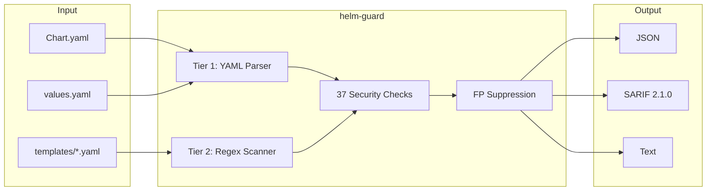

# helm-guard

Static security analysis for Helm chart supply chain integrity

[Get Started](getting-started/installation.md){ .md-button .md-button--primary }
[GitHub](https://github.com/ugiordan/helm-guard){ .md-button }

---

## Demo


---

## How It Works

helm-guard uses a three-tier parser to analyze Helm charts without requiring the helm CLI. It checks Chart.yaml, values.yaml, and template files for supply chain risks that rendered-manifest scanners miss.



**Pipeline:**

1. **Tier 1 (YAML)** parses Chart.yaml, values.yaml, Chart.lock, values.schema.json with ruamel.yaml
2. **Tier 2 (Regex)** scans template files as text for injection patterns (tpl, lookup, env)
3. **37 Security Checks** across 10 categories detect pinning, injection, trust, hooks, OLM, and CVE-based risks
4. **Tier 3 (Render)** optionally runs `helm template` for rendered manifest checks (opt-in via `--render`)

---

## Quick Example

```bash
$ helm-guard charts/my-chart --format text
```

```
Helm Chart Security Scan: charts/my-chart
Found 3 issue(s)

[CRITICAL] HLM-INJ-001: tpl function usage in templates
  File: templates/deployment.yaml:42
  Template uses tpl function enabling arbitrary template code execution
  Fix: Avoid tpl. Use direct value interpolation.

[HIGH] HLM-PIN-001: Chart dependency with SemVer range
  File: Chart.yaml:8
  Dependency 'redis' uses SemVer range '~1.2.0'. Pin to exact version.
  Fix: Pin to exact version (e.g., version: 1.2.3)

[HIGH] HLM-TRUST-002: Secrets in values.yaml
  File: values.yaml:15
  'database.password' has a non-empty default value
  Fix: Use empty defaults and set via --set or external secrets
```

Generate SARIF for GitHub Code Scanning:

```bash
helm-guard charts/my-chart --format sarif --output results.sarif
```

---

## Comparison

| Tool | Chart-Level | Template Injection | Dependency Trust | OLM Security |
|------|:-:|:-:|:-:|:-:|
| **helm-guard** | :white_check_mark: | :white_check_mark: | :white_check_mark: | :white_check_mark: |
| Checkov | :x: | :x: | :x: | :x: |
| Trivy | :x: | :x: | :x: | :x: |
| Kubescape | :x: | :x: | :x: | :x: |
| kube-linter | :x: | :x: | :x: | :x: |

helm-guard is the only tool that performs **chart-level supply chain analysis**. Existing tools scan rendered manifests for K8s best practices but miss dependency pinning, template injection, and chart provenance.

---

## Features

<div class="grid cards" markdown>

-   :material-package-variant-closed-check:{ .lg .middle } **Dependency Pinning**

    ---

    Validates SemVer ranges, Chart.lock existence, image digest pinning, and OLM subscription channel versioning.

-   :material-shield-bug:{ .lg .middle } **Template Injection Detection**

    ---

    Detects tpl (CRITICAL), lookup, env/expandenv, getHostByName, and .Files.Get with user-controlled paths. All backed by real CVEs.

-   :material-file-certificate:{ .lg .middle } **CVE-Based Checks**

    ---

    Checks grounded in CVE-2020-11013, CVE-2023-25165, CVE-2024-25620, CVE-2025-53547, CVE-2026-35204, and CVE-2022-24348.

-   :material-kubernetes:{ .lg .middle } **OLM Operator Security**

    ---

    Validates OLM subscription auto-approval, catalog source trust, channel versioning, and operator namespace isolation.

</div>

---

## What Gets Detected

37 checks across 10 categories:

| Category | Checks | Examples |
|----------|--------|---------|
| **Pinning** | HLM-PIN-001..005 | SemVer ranges, Chart.lock, image tags, OLM channels, SemVer compliance |
| **Injection** | HLM-INJ-001..008 | tpl, lookup, env, getHostByName, shell injection, .Files.Get, hardcoded registries |
| **Trust** | HLM-TRUST-001..006 | Missing schema, secrets, untrusted repos, hostNetwork, HTTP URLs, NetworkPolicy |
| **Hooks** | HLM-HOOK-001..003 | SecurityContext, delete policy, post-renderer scripts |
| **OLM** | HLM-OLM-001..004 | Auto-approval, community catalog, privileged namespace, unstable channels |
| **Provenance** | HLM-PROV-001 | Missing chart signature |
| **Namespace** | HLM-NS-001..002 | Privileged namespace, release namespace schema |
| **Dependencies** | HLM-DEP-001..003 | Security overrides, version conflicts, typosquatting |
| **Security** | HLM-SEC-001..005 | Path traversal, symlinked Chart.lock, valueFiles traversal, SA token automount |

See [Detection Rules](reference/rules.md) for the full reference.

---

## Next Steps

<div class="grid cards" markdown>

-   [Installation Guide](getting-started/installation.md)
-   [Quick Start Tutorial](getting-started/quickstart.md)
-   [Configuration](guides/configuration.md)
-   [Detection Rules Reference](reference/rules.md)

</div>
